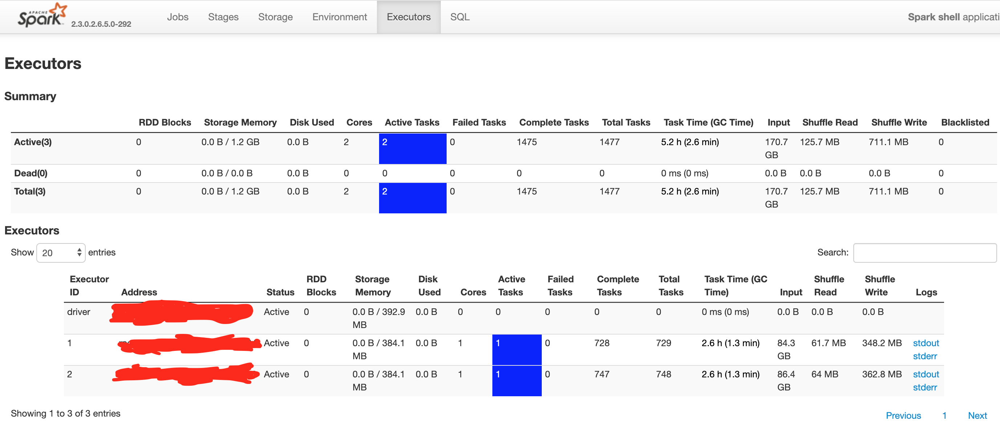

Cluster

- Number of data-nodes: 12
- Number of racks: 2

```
spark-shell --master yarn --packages com.databricks:spark-xml_2.11:0.5.0 --deploy-mode client
```
As you can see below, the default resources allocated are

- Driver: 394.1 MB RAM
- Total Executors: 2 
- Each executor: 1 core, 384.1 MB RAM 



---

```
spark-shell --master yarn --packages com.databricks:spark-xml_2.11:0.5.0 --deploy-mode client --executor-memory 8G --num-executors 12
```

**comments.count = 6.4 mins with 142 partitions**

As you can see below, the resources allocated are

- Driver: 394.1 MB RAM
- Total Executors: *12*
- Each executor: 1 core, 4.4 GB RAM 


---

```
spark-shell --master yarn --packages com.databricks:spark-xml_2.11:0.5.0 --deploy-mode client --executor-memory 8G --num-executors 24
```

**comments.count = 3.3 min mins with 142 partitions**

As you can see below, the resources allocated are

- Driver: 394.1 MB RAM
- Total Executors: *24* 
- Each executor: 1 core, 4.4 GB RAM 

