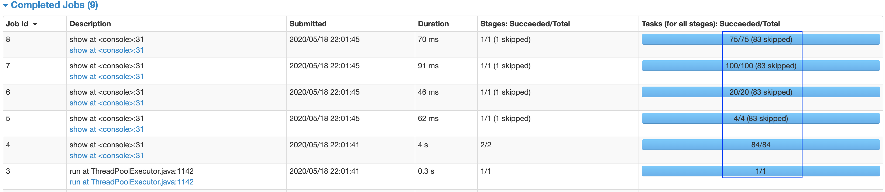

# Shuffles

> Images and some content copied from https://medium.com/swlh/revealing-apache-spark-shuffling-magic-b2c304306142

## Introduction


The shuffling is an expensive operation as it involves **Disk I/O, Data Serialization & Network I/O**. Operations that can cause shuffle are:

1. Repartition operations like `repartition` or `coalesce`
2. ByKey operations like `reduceByKey` or `aggregateByKey`
3. Join operations like `cogroup` or `join`
4. Aggregations with `groupBy`

- Spark has three shuffle implementations: hash, sort (default since 1.2.0) and tungsten-sort. Can be specified using `spark.shuffle.manager` property  
- Operations that trigger shuffles use hashmaps or in-memory buffers data structures to group or sort
- Some operations use these data structures only reduce-side (`join`, `cogroup`, `groupByKey`) or both (`reduceByKey`, `aggregateByKey`)
- Spark reduce phase **doesn't overlap** with map phase

### Map-side Shuffle

- hash implementation
    - Each map task writes one shuffle file (os disk buffer) per reduce task, thus there will be `M*R` shuffle files
- sort shuffle implementation
    - Uses `SortShuffleWriter` or `UnsafeShuffleWriter`
    - Produces two files 1) index file 2) data file
    - 
    - 1 shuffle data file is produced per Mapper
    - Process
        - Buffer is used to store and sort the records on the basis of targeted shuffle partitions
        - If the buffer limit is reached then the contects are first sorted and then **spilled** to disk in a temp shuffle file
        - If the buffer limit is reached multiple times then multiple spill files could be created
        - 
        - At the end of the above process, all the spilled files are again read and merge to create the final index and data files
- `spark.shuffle.compress` - whether the engine would compress shuffle outputs or not
- `spark.shuffle.spill.compress` - whether to compress intermediate shuffle spill files or not
- Snappy (LZF can be configured using `spark.io.compress.codec`) is used to compress the map outputs by default

### Reduce-side Shuffle

- Shuffle is a pull operation in Spark unlike Hadoop where it is a push operation
- Shuffle read operation is executed using `BlockStoreShuffleReader`
- sort shuffle implementation
    - A buffer is used to fetch the shuffle blocks
    - Multiple spill files are created if the read buffer is full 
    - 
    - After all shuffle blocks are fetched (using `BlockManager`), all the spill files are read and merged to generate the final `iterator` of data records to be read
- Spark requires all data to fit into memory of the corresponding reducer task (`reduceByKey`, `aggregateByKey`)
- Each reducer maintains a network buffer to fetch map outputs. Default size is `48 MB`. Can be configured using `spark.reducer.maxMbInFlight`

## Shuffle Block

~[](https://miro.medium.com/max/650/1*swN2t9U1YYqQzQifZcIwEw.png)

- Shuffle block is represented by Tuple of (`ShuffleId`, `MapId`, `ReduceId`)
- Is fetched by `BlockManager` of an *Executor* (or via external shuffle service)
- All shuffle blocks of a shuffle stage are tracked by `MapOutputTracker` hosted on *Driver*

### Important

- Disk spills directory is specified by `spark.local.dir` or `SPARK_LOCAL_DIRS` or `LOCAL_DIRS` on YARN
- All shuffle blocks of a shuffle stage are tracked by `MapOutPutTracker` hosted in the driver
- If the status of a Shuffle block is absent against a shuffle stage tracked by MapOutPutTracker, then it leads to `MetadataFetchFailedException` in the 
reducer task corresponding to ReduceId in Shuffle block.
- Failure in fetching the shuffle block from the designated Block manager leads to `FetchFailedException` in the corresponding reducer task.

## Shuffle optimization

### Before



Jobs 5, 6, 7 and 8 are launched with lot of tasks against lot of empty partitions (Specifics shown below).
These empty tasks, though not doing any work, will add up to the overall processing time

1. Schedular delay
2. Task Deserialization Time

| Job # | Total Stages | Launched Tasks | Empty Tasks/Partitions | Records to process |
| ---- |---- |---- |---- |---- |
|5 |2 (1 skipped) |4 |3 |50 |
|6 |2 (1 skipped) |20 |19 |50 |
|7 |2 (1 skipped) |100 |96 |223 |
|8 |2 (1 skipped) |75 |71 |200  |

[Refer the query plan](query-plan-before-optimize.pdf)

## After


We can avoid these empty partitions by reducing the **shuffle partitions** by setting

```
spark.conf.set("spark.sql.shuffle.partitions", 1)
```
[Refer the query plan](query-plan-after-optimize.pdf)

## Reference

- [Step by step visual on Shuffling](https://www.slideshare.net/SandyRyza/spark-job-failures-talk)
- [Hash based Implementation Paper](https://people.eecs.berkeley.edu/~kubitron/courses/cs262a-F13/projects/reports/project16_report.pdf)
- [Sort based implementation](https://medium.com/swlh/revealing-apache-spark-shuffling-magic-b2c304306142)