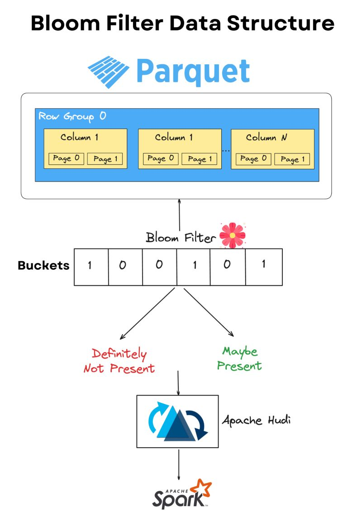

## Bloom Filter Data Structure.

A Bloom filter is a probabilistic data structure that allows you to identify whether an item belong to a data set or
not.

- It either outputs: "definitely not present" or "maybe present" for every data search.
- It can return false positive matches (says an element is in the set when it isn't), but never false negatives (if it
  says an element is not in the set, it definitely isn't).
- Bloom filters uses multiple hash functions to map elements to a fixed-size array of bits, which makes it space
  efficient as compared to say a list.

They are used widely in database systems to reduce expensive disk lookups. Coming to datalake, we can use bloom filters
to efficiently skip over large portions of Parquet files that are irrelevant to our query,
reducing the amount of data that needs to be read & processed.

- It is adapted by lakehouse table formats such as Delta and Apache Hudi to skip non-relevant row groups from data
  files.
- This can be very valuable for improving query performance & reducing I/O operations when dealing with large-scale
  data.

Using these statistics together with Hudi's robust multi-modal subsystem can provides significant edge in query
performance.

## Steps to write data to Parquet in cloud object storage:

1. Compute data in memory (may involve spilling to disk)
2. Serialize result set to Parquet format
   a. encode pages (e.g. dictionary encoding)
   b. compress pages (e.g. Snappy)
   c. index pages (calculate min-max stats)
3. Transfer serialized data over wire: compute node(s. ➜ storage node
4. Write serialized data to disk

Steps to read data from Parquet in cloud object storage:

1. Read metadata
2. Read serialized data from disk (use metadata for predicate/projection pushdown to only fetch pages needed for query
   at hand)
3. Transfer serialized data over wire: storage node ➜ compute node(s)
4. Deserialize to in memory format:
   a. decompress
   b. decode

Some writes (UPDATE/DELETE/MERGE. require a read. In that case, both the read and write steps are executed in sequence.

**It's hard to achieve low latency when using Parquet (or Parquet-based table formats. on cloud object stores because of
all these steps.**

## Medallian Architecture

The "Medallion Architecture" is a way to organize data in a lakehouse. It's done differently everywhere, but the general
idea is always the same.

1. data is loaded "as-is" into the "bronze layer" (also often called "raw"). An ingestion pipeline extracts data from
   source systems and loads it into tables in the lake, without transformations and schema control—this is "Extract and
   Load" (EL)
2. data then moves to the "silver layer" (also often called "refined" or "curated"). A transformation pipeline applies
   standard technical adjustments (e.g. column naming convention, type casting, deduplication, ...) and schema control (
   enforcement or managed evolution)
3. data finally arrives at the"gold layer". A transformation pipeline applies fit-for-purpose changes to prepare data
   for consumption (e.g. interactive analytics, reports/dashboards, machine learning)—One Big Table (OBT) or Kimball
   star schema data models make sense here

As data moves through the layers, it changes

- from dirty to clean
- from normalized to denormalized
- from granular to aggregated
- from source-specific to domain-specific

Key points

- The flow is often ELtT-like: smaller transformations in silver ("t"), heavy transformations in gold ("T").
- Bronze and silver are optimized for write performance. data resembles format in sources systems, so no big (slow)
  transformations are needed ➜ writes are fast
- Gold is optimized for read performance. big transformations (joins, aggregations, ...) are applied at write time so
  they don't need to be applied on-the-fly at read time (e.g. when a user runs an interactive query or when a dashboard
  queries the gold table) ➜ reads are fast

> Medallion Architectures come in many shapes and forms. It's common to find more than three layers, or tables that do
> not perfectly fit in either of them.