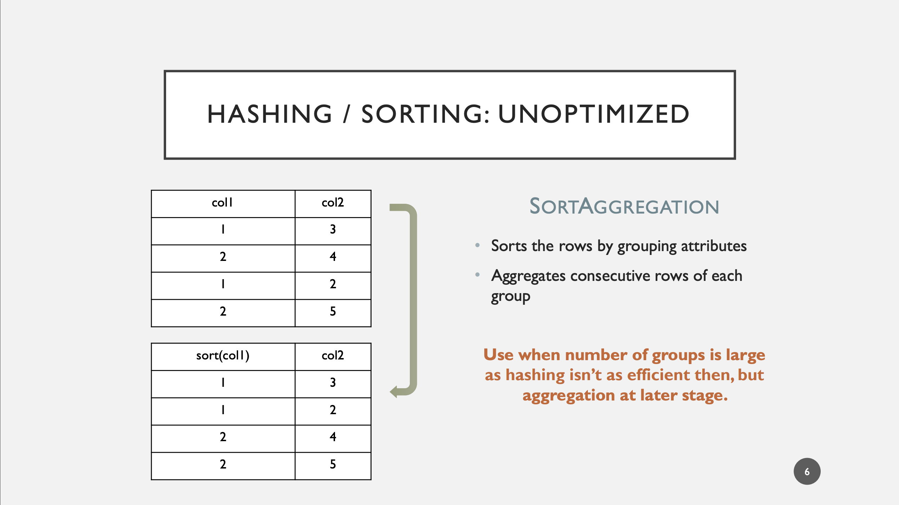

# Aggregations

Spark SQL supports 3 execution strategies or Operators

1. HashAggregation
    - Faster
    - Only limited to Typed primitives
    - Uses [UnsafeRow](https://www.waitingforcode.com/apache-spark-sql/spark-project-tungsten/read)
2. SortAggregation
    - More expensive than HashAggregation
    - Potentially slowest among the three
    - Use when number of groups is large as HashAggregation isn’t as efficient then
3. [ObjectHashAggregated](https://issues.apache.org/jira/secure/attachment/12834260/%5BDesign%20Doc%5D%20Support%20for%20Arbitrary%20Aggregation%20States.pdf)
    - More performant than SortAggregate
    - Potentially consumes more memory and CPU than SortAggregate

## Introduction

## HashAggregation

## SortAggregation

## Reference

- [Hasing is Sorting](https://people.csail.mit.edu/jshun/6886-s19/lectures/lecture12-2.pdf)
- [Selecting one of 3 Aggregation Physical operators](https://www.waitingforcode.com/apache-spark-sql/aggregations-execution-apache-spark-sql/read)
- [The case for ObjectHashAggregateExec](https://issues.apache.org/jira/secure/attachment/12834260/%5BDesign%20Doc%5D%20Support%20for%20Arbitrary%20Aggregation%20States.pdf)