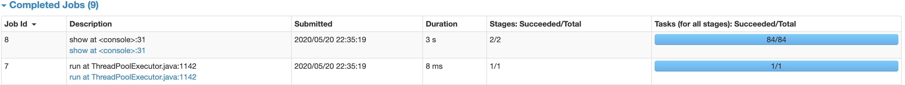

# Shuffles

## Before optimization


Jobs 5, 6, 7 and 8 are launched with lot of tasks against lot of empty partitions (Specifics shown below).
These empty tasks, though not doing any work, will add up to the overall processing time

1. Schedular delay
2. Task Deserialization Time

| Job # | Total Stages | Launched Tasks | Empty Tasks/Partitions | Records to process |
| ---- |---- |---- |---- |---- |
|5 |2 (1 skipped) |4 |3 |50 |
|6 |2 (1 skipped) |20 |19 |50 |
|7 |2 (1 skipped) |100 |96 |223 |
|8 |2 (1 skipped) |75 |71 |200  |

[Refer the query plan](query-plan-before-optimize.pdf)

## After optimization



We can avoid these empty partitions by reducing the **shuffle partitions** by setting

```
spark.conf.set("spark.sql.shuffle.partitions", 1)
```
[Refer the query plan](query-plan-after-optimize.pdf)
