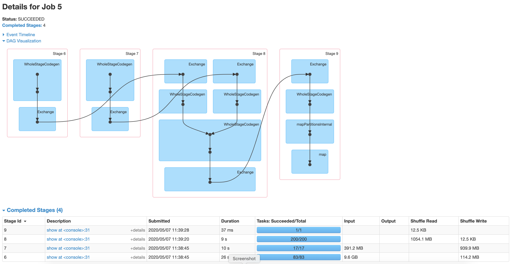
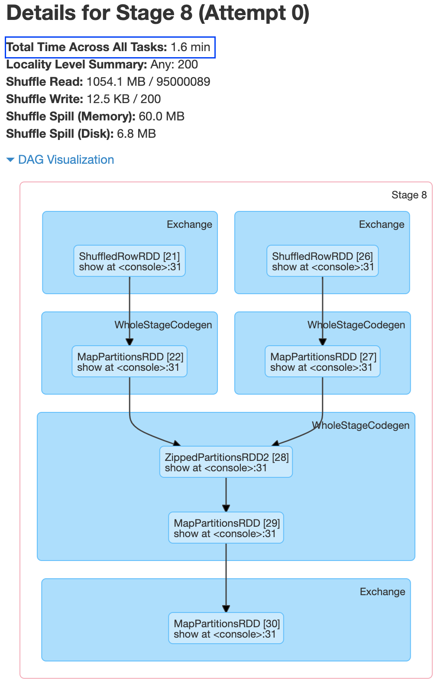
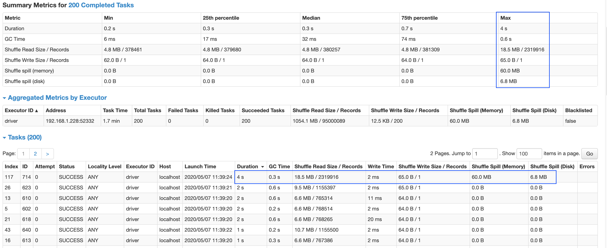
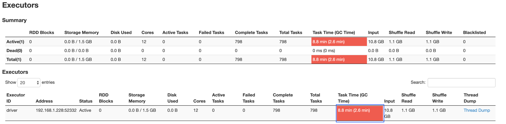
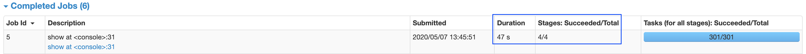
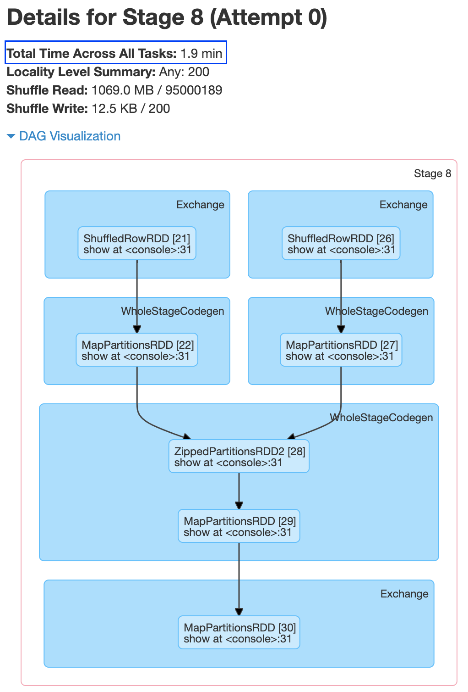
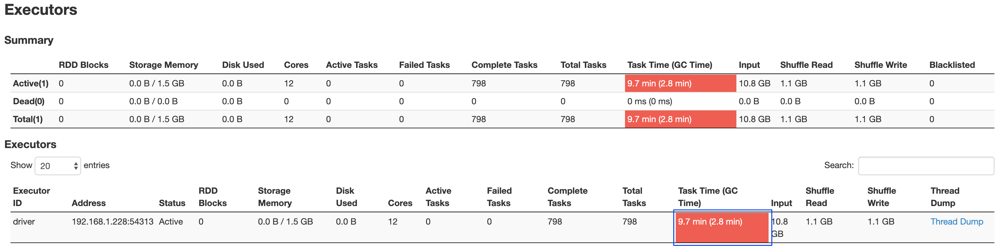

# Skew

## Table of Contents

1. [Introduction](#Introduction)
2. [Symptoms](#Symptoms)
3. [Solutions](#Solutions)
    - [Salting](#Salting)
        - [Without Salting](#WithoutSalting)
        - [With Salting](#WithSalting)
            - [Salting - Replication factor of 50](#SaltingWithReplicationFactor50)
            - [Salting - Replication factor of 150](#SaltingWithReplicationFactor150)
4. [Reference](#Reference)

## Introduction

Data skew happens when each of the partitions have uneven distribution of data.

> In statistical terms, data is skewed when mean, median and mode aren't equal to each 
> other, as in the case with normal distribution.

## Symptoms

- Inconsistent processing times
- Strangler/frozen stages and tasks
- Low CPU utilization
- OOM errors

*Joins* and *Aggregations (group by)* are the scenarios where skewing can occur 
(mostly where the data needs to be shuffled i.e. 
records of the same key should be co-located in the same partition)

- too many `null` values in a key
- one key has very high cardinality. For e.g. one `product` is sold more than other products

## Solutions

### Salting 

#### WithoutSalting

##### Code

`WhatIsTheAverageRevenueOfTheOrdersApp`

##### Job - Summary View


##### Job - Details View


##### SQL Query View

[SQL](spark-webui-sql-view.pdf)

##### Join/Shuffle Stage - Details View


##### Join/Shuffle Stage - Event Timeline View


##### Join/Shuffle Stage - Task View


##### Executor Memory


#### WithSalting

- Had to increase the driver memory to `3G` in spark-shell to successfully run

```
./bin/spark-shell --driver-memory 3G
```

- `WhatIsTheAverageRevenueOfTheOrdersAppOptimized`

##### SaltingWithReplicationFactor50

###### Job - Summary View


###### Job - Details View



###### SQL Query View

[SQL](./iteration1/spark-webui-sql-view-optimize1.pdf)

###### Join/Shuffle Stage - Details View



###### Join/Shuffle Stage - Event Timeline View


###### Join/Shuffle Stage - Task View



###### Executor Memory



#### SaltingWithReplicationFactor150

###### Job - Summary View



###### Job - Details View


###### SQL Query View

[SQL](./iteration2/spark-webui-sql-view-optimization2.pdf)

###### Join/Shuffle Stage - Details View



###### Join/Shuffle Stage - Event Timeline View


###### Join/Shuffle Stage - Task View


###### Executor Memory



## Reference

- https://dataengi.com/2019/02/06/spark-data-skew-problem/